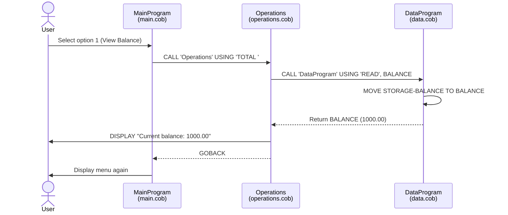
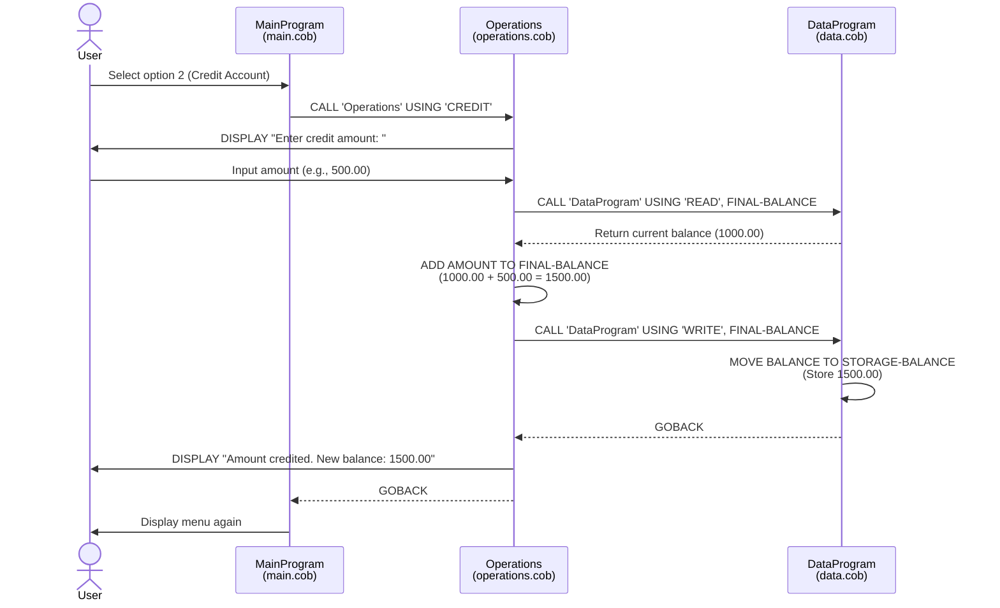
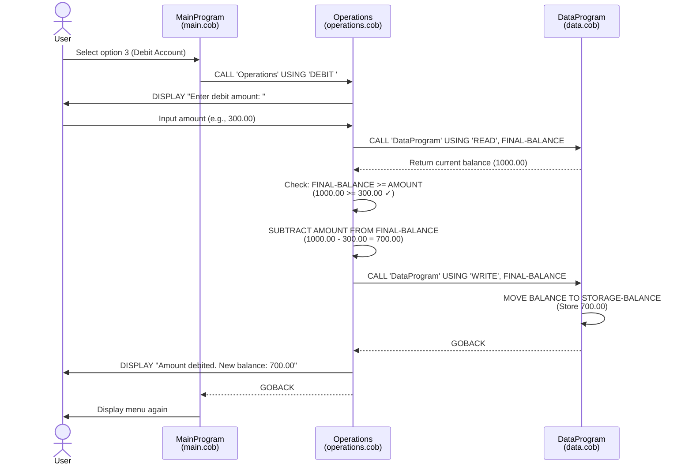
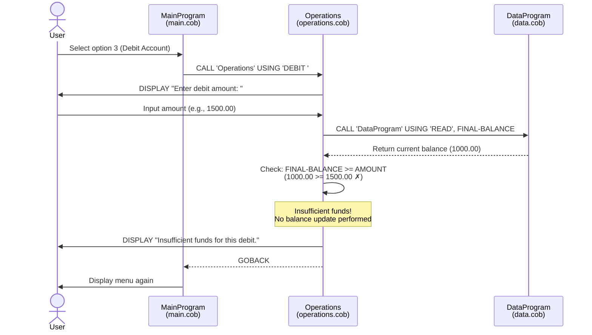
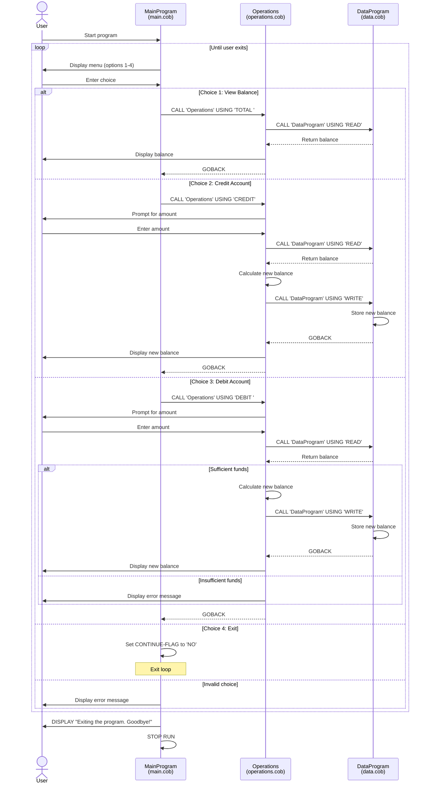

# COBOL Account Management System Documentation

## Overview

This legacy COBOL application implements a simple account management system for student accounts. The system allows users to view balances, credit (deposit) funds, and debit (withdraw) funds from a student account.

## Architecture

The application follows a modular design with three main COBOL programs that work together:

1. **main.cob** - User interface and program flow control
2. **operations.cob** - Business logic for account operations
3. **data.cob** - Data persistence layer

## File Descriptions

### 1. main.cob (MainProgram)

**Purpose**: Serves as the entry point and user interface for the account management system.

**Key Functions**:
- Displays an interactive menu with four options:
  1. View Balance
  2. Credit Account (deposit)
  3. Debit Account (withdraw)
  4. Exit
- Accepts user input and routes requests to the appropriate operations
- Implements a loop that continues until the user chooses to exit
- Validates user input and displays error messages for invalid choices

**Program Flow**:
- Displays the menu repeatedly in a loop
- Evaluates user choice (1-4)
- Calls the `Operations` program with the appropriate operation type
- Continues until user selects option 4 (Exit)

**Variables**:
- `USER-CHOICE`: Stores the user's menu selection (1-4)
- `CONTINUE-FLAG`: Controls the main program loop ('YES' or 'NO')

---

### 2. operations.cob (Operations)

**Purpose**: Contains the core business logic for all account operations.

**Key Functions**:

1. **View Balance (TOTAL)**
   - Retrieves the current account balance from the data layer
   - Displays the balance to the user

2. **Credit Account (CREDIT)**
   - Prompts user for the amount to deposit
   - Reads the current balance
   - Adds the credit amount to the balance
   - Writes the updated balance back to storage
   - Displays the new balance

3. **Debit Account (DEBIT)**
   - Prompts user for the amount to withdraw
   - Reads the current balance
   - Validates that sufficient funds are available
   - If funds are sufficient:
     - Subtracts the debit amount from the balance
     - Writes the updated balance back to storage
     - Displays the new balance
   - If funds are insufficient:
     - Displays an error message
     - Does not modify the balance

**Variables**:
- `OPERATION-TYPE`: Stores the type of operation to perform
- `AMOUNT`: Stores the transaction amount (for credit/debit operations)
- `FINAL-BALANCE`: Working variable for balance calculations (initialized to 1000.00)

**Business Rules**:
- All operations interact with the data layer through the `DataProgram`
- Debit operations require sufficient funds (balance >= debit amount)
- Credit operations have no limit
- Balance is displayed after each successful transaction

---

### 3. data.cob (DataProgram)

**Purpose**: Manages data persistence and provides a simple data access layer for the account balance.

**Key Functions**:

1. **READ Operation**
   - Returns the current stored balance
   - Does not modify any data

2. **WRITE Operation**
   - Updates the stored balance with the passed value
   - Persists the new balance for future operations

**Variables**:
- `STORAGE-BALANCE`: The persistent account balance (initialized to 1000.00)
- `OPERATION-TYPE`: Determines whether to read or write data
- `PASSED-OPERATION`: Linkage parameter for operation type
- `BALANCE`: Linkage parameter for balance value (input/output)

**Data Structure**:
- Balance format: `PIC 9(6)V99` - supports up to 999,999.99
- Operations: 'READ' or 'WRITE' (6-character strings)

---

## Business Rules for Student Accounts

### Balance Management
1. **Initial Balance**: Each account starts with a default balance of $1,000.00
2. **Balance Range**: Supports balances from $0.00 to $999,999.99
3. **Precision**: All monetary values use two decimal places

### Transaction Rules

#### Credit Operations (Deposits)
- No minimum or maximum limit specified
- Immediately updates the account balance
- Always succeeds (no validation constraints)

#### Debit Operations (Withdrawals)
- **Insufficient Funds Check**: Must have sufficient balance to complete the transaction
- Cannot withdraw more than the current balance (no overdrafts allowed)
- If insufficient funds, the transaction is rejected and balance remains unchanged
- Transaction must be for a positive amount

#### Balance Inquiries
- Read-only operation
- No side effects on the account balance
- Always returns the most recent balance

### Data Integrity
- All balance updates are atomic (read-modify-write pattern)
- Balance is always retrieved fresh before any modification
- Updates are immediately persisted after calculation

## Program Interactions

```
┌─────────────┐
│ MainProgram │
│  (main.cob) │
└──────┬──────┘
       │
       │ CALL 'Operations'
       ▼
┌─────────────┐
│ Operations  │
│(operations. │
│    cob)     │
└──────┬──────┘
       │
       │ CALL 'DataProgram'
       ▼
┌─────────────┐
│DataProgram  │
│ (data.cob)  │
└─────────────┘
```

## Usage Flow

1. User starts the program (`main.cob`)
2. Main menu is displayed
3. User selects an option:
   - **Option 1**: View balance → Operations calls DataProgram (READ) → Balance displayed
   - **Option 2**: Credit account → User enters amount → Operations reads balance, adds amount, writes new balance
   - **Option 3**: Debit account → User enters amount → Operations validates funds, subtracts amount (if valid), writes new balance
   - **Option 4**: Exit → Program terminates
4. After each operation, the menu is displayed again (except for exit)

## Technical Notes

### Variable Formats
- **Numeric values**: `PIC 9(6)V99` (6 digits, 2 decimal places)
- **Operation codes**: `PIC X(6)` (6-character alphanumeric)
- **Flags**: `PIC X(3)` or `PIC 9` (single digit for menu choices)

### Operation Codes
- `'TOTAL '`: View balance (note the trailing space)
- `'CREDIT'`: Deposit funds
- `'DEBIT '`: Withdraw funds (note the trailing space)
- `'READ'`: Internal operation for retrieving balance
- `'WRITE'`: Internal operation for storing balance

### Program Calls
- Programs are called using COBOL's `CALL` statement
- Parameters are passed using the `USING` clause
- Linkage section defines the interface between programs
- `GOBACK` statement returns control to the calling program

## Future Modernization Considerations

When modernizing this legacy code, consider:
1. Adding transaction history/audit trail
2. Supporting multiple student accounts with unique identifiers
3. Adding authentication and authorization
4. Implementing more sophisticated validation rules
5. Adding support for different transaction types (fees, refunds, etc.)
6. Improving error handling and logging
7. Adding persistence to a database instead of in-memory storage
8. Implementing account limits and transaction limits
9. Adding date/time stamps to transactions
10. Supporting concurrent access and transaction locking

## Sequence Diagrams

### View Balance Operation



### Credit Account Operation (Deposit)



### Debit Account Operation (Withdrawal - Sufficient Funds)



### Debit Account Operation (Withdrawal - Insufficient Funds)



### Complete Application Flow


